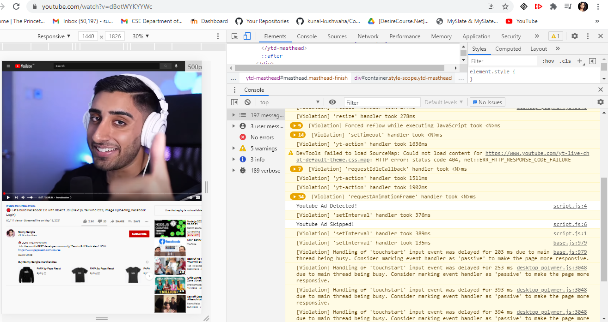

# MyChromeExtensions
Built extensions that adds few functionalities to browser

### 1. Counts and displays the number of times "covid" occurs in a webpage
[covid-count](basics/popup_output.txt)
### 2. Quick launcher to access social media sites

### 3. Skips and blocks youtube ads from playing

